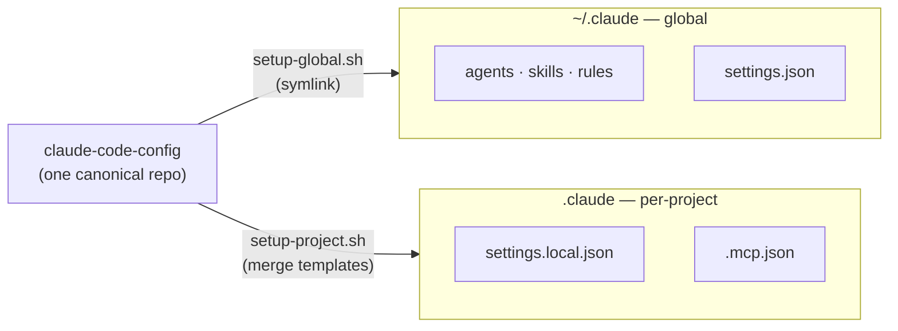

<div align="center">

# Claude Code Config

[](https://github.com/edjchapman/claude-code-config/actions/workflows/validate-config.yml)
[](LICENSE)
[](https://claude.ai/code)

**A single source of truth for [Claude Code](https://claude.ai/code) — reusable agents, skills, hooks, and permission templates that propagate to every project and machine.**

`14 specialist agents` · `18 skills` · `14 permission templates` · `7 MCP templates` · `8 lifecycle hooks` · `2 style rules` · `4 CLI scripts`

<br/>


<sub><code>setup-project.sh --dry-run django react</code> — two stacks compose into one merged, deny-aware permission set.</sub>

</div>

---

## Contents

- [🤔 Why This Exists](#-why-this-exists)
- [🚀 Quick Start](#-quick-start)
- [🧰 What's Inside](#-whats-inside)
- [🧭 Choosing & Composing](#-choosing--composing)
- [🔧 How Setup Works](#-how-setup-works)
- [🎨 Customization](#-customization)
- [❓ Troubleshooting](#-troubleshooting)
- [📋 Requirements](#-requirements)
- [📚 Project & Docs](#-project--docs)

---

## 🤔 Why This Exists

Claude Code stores configuration in `~/.claude/` (global) and `.claude/` (per-project). Keeping that consistent across projects and machines is tedious — agents get copied around, commands are duplicated, permission templates drift, and every new machine means manual setup.

This repo fixes that with **one canonical config** that everything else links back to:

- **Symlinks** so updates propagate everywhere automatically
- **Composable templates** for different project types
- **Hooks** for auto-formatting, safety checks, and notifications
- **Skills & rules** for passive domain knowledge and style enforcement
- **Setup scripts** that work on any machine



One repo links into every machine (global symlinks) and composes per-project permissions (template merge) — so a change here propagates everywhere instead of being copied around.

---

## 🚀 Quick Start

There are two ways to consume this repo: as a **plugin** (recommended) or as a **symlinked global config** (legacy, still supported). Both modes coexist — hook paths use `${CLAUDE_PLUGIN_DIR:-<readlink fallback>}`, so they resolve either way.

### Option A — Plugin install (recommended)

```bash
# From inside Claude Code:
/plugin marketplace add edjchapman/claude-code-config
/plugin install claude-code-config
```

Then add per-project permissions only:

```bash
cd ~/my-django-project
~/Development/claude-code-config/scripts/setup-project.sh django   # settings.local.json + .mcp.json
```

### Option B — Symlinked global config (legacy)

```bash
# 1. Clone (or fork to customize)
git clone https://github.com/edjchapman/claude-code-config.git ~/claude-code-config

# 2. Global config (symlinks into ~/.claude/)
~/Development/claude-code-config/scripts/setup-global.sh

# 3. Project config (from your project directory)
cd ~/my-django-project
~/Development/claude-code-config/scripts/setup-project.sh django

# 4. Start Claude Code — agents and skills are now available
claude
```

> **Tip — alias it.** Add `alias claude-setup='~/Development/claude-code-config/scripts/setup-project.sh'` to your shell profile, then run `claude-setup django react`.

### Fork or Clone?

| Approach  | When to use                                   |
| --------- | --------------------------------------------- |
| **Clone** | Use as-is, or contribute improvements back    |
| **Fork**  | Customize agents/skills for your own workflow |

Forks can still pull upstream updates:

```bash
git remote add upstream https://github.com/edjchapman/claude-code-config.git
git fetch upstream && git merge upstream/main
```

---

## 🧰 What's Inside

Everything falls into two modes — tools you **invoke** and tools that **auto-activate**:

|             | Active (you invoke)                             | Passive (auto-activates)                                                     |
| ----------- | ----------------------------------------------- | ---------------------------------------------------------------------------- |
| **What**    | Specialist agents, workflow skills, CLI scripts | Domain skills, rules, hooks                                                  |
| **How**     | `@name`, `/name`, or shell command              | Skills load by description; rules/hooks by file patterns or lifecycle events |
| **Example** | `@bug-resolver`, `/commit`, `daily-report.sh`   | `testing-patterns` loads when you write tests                                |

> Some capabilities are now handled by **bundled plugins** rather than custom artifacts: `/review` + `pr-review-toolkit:review-pr` (code review), `feature-dev:code-architect` (implementation blueprints), `/security-review` (security audits).

### Agents

Invoke with `@agent-name`. **Opus** = complex reasoning (higher cost); **Sonnet** = pattern-based, faster.

<details>
<summary><strong>14 specialist agents</strong> — click to expand</summary>

| Agent                      | What It Does                                           | Model  |
| -------------------------- | ------------------------------------------------------ | ------ |
| `@bug-resolver`            | Systematic debugging, root cause analysis              | opus   |
| `@ci-debugger`             | CI/CD failure investigation, flaky tests               | sonnet |
| `@database-architect`      | Schema design, migration planning, query optimization  | opus   |
| `@dependency-manager`      | Dependency audit, outdated packages, license checks    | sonnet |
| `@devops-engineer`         | Infrastructure, CI/CD pipelines, containers            | opus   |
| `@documentation-writer`    | README, API docs, ADRs, onboarding guides              | sonnet |
| `@e2e-playwright-engineer` | Create and debug Playwright E2E tests                  | sonnet |
| `@git-helper`              | Complex git: rebase, conflicts, recovery               | sonnet |
| `@migration-engineer`      | Database migrations, framework upgrades, zero-downtime | opus   |
| `@performance-engineer`    | Profiling, bottleneck analysis, optimization           | opus   |
| `@pr-review-bundler`       | Bundle PR reviews into markdown                        | sonnet |
| `@refactoring-engineer`    | Systematic, safe refactoring                           | opus   |
| `@security-auditor`        | Security audit, OWASP, dependency vulnerabilities      | opus   |
| `@test-engineer`           | Create unit and integration tests                      | sonnet |

> **Provided by enabled plugins instead:** general code review (`pr-review-toolkit:code-reviewer`, `feature-dev:code-reviewer`), spec/architecture (`feature-dev:code-architect`), simplification (`code-simplifier`). Custom versions were retired in favour of these.

</details>

### Workflow Skills

Invoke with `/<name>`. Custom commands were merged into skills upstream, so these live in `skills/<name>/SKILL.md` alongside the domain skills (this repo's former `commands/` directory was migrated accordingly). Skills with a "Use when…" clause can also be auto-invoked by Claude from plain English (e.g. "commit my staged work" → `/commit`); user-only ones set `disable-model-invocation: true`. `/standup` and `/eow-review` can additionally be fired by a scheduled routine.

<details>
<summary><strong>10 workflow skills</strong> — click to expand</summary>

| Slash         | What It Does                                                     | Who Can Invoke             |
| ------------- | ---------------------------------------------------------------- | -------------------------- |
| `/commit`     | Analyze staged changes, generate commit message                  | you or Claude              |
| `/pr`         | Create PR with auto-generated description                        | you or Claude              |
| `/hotfix`     | Guided hotfix: branch from main, minimal fix, targeted tests, PR | you or Claude              |
| `/tdd`        | TDD workflow: write failing test, implement, refactor            | you or Claude              |
| `/adr`        | Create Architecture Decision Record (Nygard format)              | you or Claude              |
| `/standup`    | Summarize last 24h across Git, GitHub, Jira, and Notion          | you, Claude, or a schedule |
| `/eow-review` | Prepare end-of-week review notes                                 | you, Claude, or a schedule |
| `/status`     | Quick status update appended to today's daily log                | you only                   |
| `/refinement` | Prepare technical analysis for backlog refinement                | you only                   |
| `/later`      | Create a personal backlog item (learn, research, do, read)       | you only                   |

> **Provided by the harness (not in this repo):** `/review`, `/security-review`, `/init`, `/ultrareview`, `/less-permission-prompts`.

</details>

### Domain Skills

Domain knowledge Claude loads automatically based on the conversation — matched from each skill's `description:`, no explicit invocation needed. Skills use the nested layout `skills/<name>/SKILL.md`.

<details>
<summary><strong>8 domain skills</strong> — click to expand</summary>

| Skill                 | Loads When You…                                       | What It Covers                                    |
| --------------------- | ----------------------------------------------------- | ------------------------------------------------- |
| `git-workflow`        | Work with branches, commits, PRs, or releases         | Conventional commits, branch naming, PR size      |
| `testing-patterns`    | Write or review tests, fixtures, mocks, coverage      | AAA pattern, factories, coverage                  |
| `security-review`     | Touch auth, middleware, routes, or input validation   | Input validation, JWT, CSRF, secrets              |
| `api-design`          | Design or review REST APIs, endpoints, or serializers | REST conventions, status codes, pagination        |
| `django-patterns`     | Edit Django models, views, managers, or signals       | Fat models, managers, query optimization, signals |
| `docker-patterns`     | Edit Dockerfiles, Compose files, or build contexts    | Multi-stage builds, layer caching, security       |
| `infrastructure`      | Edit Terraform, Kubernetes manifests, or Helm charts  | Terraform modules, K8s resources, Helm charts     |
| `root-cause-analysis` | Investigate incidents, regressions, or recurring bugs | Root causes over symptom-level bandaids           |

</details>

### Rules

Path-scoped style enforcement (`paths` frontmatter). Skills provide patterns; rules enforce style.

<details>
<summary><strong>2 style rules</strong> — click to expand</summary>

| Rule               | Applies To            | What It Enforces                                                         |
| ------------------ | --------------------- | ------------------------------------------------------------------------ |
| `python-style`     | `**/*.py`             | Naming, error handling, imports, type hints                              |
| `typescript-style` | `**/*.ts`, `**/*.tsx` | Naming, error handling, type usage, plus React-specific rules for `.tsx` |

</details>

### Hooks

Run automatically at lifecycle events. Configured in `settings.json` (symlinked globally, so active in all projects); scripts live in `scripts/hooks/` and only run when their tools are present (e.g. `ruff`, `prettier`).

<details>
<summary><strong>8 configured hooks + 2 opt-in</strong> — click to expand</summary>

**Configured:**

| Hook                      | Trigger              | What It Does                                                   |
| ------------------------- | -------------------- | -------------------------------------------------------------- |
| SessionStart              | New session          | Outputs git branch, recent commits, and dirty files            |
| SessionEnd                | Session end          | Appends session summary to `./standups/YYYY-MM-DD-log.md`      |
| PostToolUse (Write\|Edit) | After file edits     | Auto-formats Python (ruff) and JS/TS (prettier), async         |
| PostToolUseFailure        | After tool failure   | Logs failed tool calls to `~/.claude/logs/tool-failures.jsonl` |
| PreToolUse (Bash)         | Before bash commands | Blocks dangerous patterns (`rm -rf /`, `dd`, etc.)             |
| PreCompact                | Before compaction    | Saves working state (branch, staged files, recent commits)     |
| Stop                      | Turn about to end    | Prompt-type LLM gate: blocks "done" claims with skipped tests  |
| TaskCompleted             | Autonomous task done | Emits a terminal bell                                          |

The `Stop` gate is a native `type: "prompt"` hook (no script, evaluated by a fast
model). Delete its entry from `settings.json` and `hooks/hooks.json` to opt out.

**Opt-in** (each invokes an LLM on every fire — enable deliberately):

| Hook             | Trigger                 | What It Would Do                                  |
| ---------------- | ----------------------- | ------------------------------------------------- |
| UserPromptSubmit | Before prompt sent      | LLM-evaluated check: is the prompt specific?      |
| SubagentStop     | Before subagent returns | LLM-evaluated check: did subagent complete fully? |

</details>

### Settings Templates

Composable permission sets merged into `settings.local.json`. `base` is always included; `deny` beats `allow` during merge.

<details>
<summary><strong>14 permission templates</strong> — click to expand</summary>

```bash
setup-project.sh python          # Python project
setup-project.sh django react    # Full-stack (combine multiple)
setup-project.sh all             # ALL templates
```

| Template     | What It Allows                                                                                                     |
| ------------ | ------------------------------------------------------------------------------------------------------------------ |
| `all`        | All templates below combined                                                                                       |
| `base`       | Git, GitHub CLI, file operations, WebSearch _(always included)_                                                    |
| `python`     | pytest, mypy, ruff, black, isort, flake8, pylint, bandit, pre-commit, pip, uv, poetry                              |
| `django`     | Django manage.py commands (test with --no-input --parallel=8), docker compose, make, uv run (flake8, basedpyright) |
| `react`      | npm, yarn, pnpm, vitest, playwright, TypeScript, eslint, prettier                                                  |
| `node`       | npm, yarn, pnpm, vitest, jest, mocha, eslint, prettier, tsc, bun                                                   |
| `nextjs`     | Next.js dev/build/lint, Vercel CLI, npm/yarn/pnpm, vitest, playwright                                              |
| `fastapi`    | uvicorn, alembic, pytest, ruff, mypy, uv, poetry, docker compose                                                   |
| `go`         | go build/test/run, golangci-lint, staticcheck, dlv, mockgen, wire                                                  |
| `docker`     | Docker build, compose, buildx, system commands                                                                     |
| `java`       | Gradle, Maven, Java compilation (javac, jar)                                                                       |
| `kubernetes` | kubectl, helm, kustomize, kubectx, stern                                                                           |
| `rust`       | cargo, rustc, rustup, rustfmt, clippy                                                                              |
| `terraform`  | terraform fmt/validate/plan/init                                                                                   |
| `aws`        | AWS CLI describe/validate (read-only), cfn-lint, cfn-guard, cdk synth/diff (deletion & deploy denied)              |

</details>

### MCP Templates

MCP server configs generated alongside `settings.local.json` when a matching template exists.

<details>
<summary><strong>MCP server templates</strong> — click to expand</summary>

| Template  | MCP Servers                                          |
| --------- | ---------------------------------------------------- |
| `base`    | None (MCP is opt-in)                                 |
| `django`  | PostgreSQL (`@modelcontextprotocol/server-postgres`) |
| `nextjs`  | PostgreSQL (`@modelcontextprotocol/server-postgres`) |
| `fastapi` | PostgreSQL (`@modelcontextprotocol/server-postgres`) |
| `python`  | SQLite (`mcp-server-sqlite-npx`)                     |
| `node`    | SQLite (`mcp-server-sqlite-npx`)                     |
| `aws`     | AWS IaC (`awslabs.aws-iac-mcp-server`, via `uvx`)    |

Web/DB frameworks (`django`, `nextjs`, `fastapi`) default to PostgreSQL; generic `python` and `node` use SQLite, since there's no shared external DB to assume. The remaining stacks (`go`, `rust`, `java`, `kubernetes`, `terraform`) fall through to `base.json` — add servers manually in the project's `.mcp.json` when needed. Playwright is a first-class plugin (`playwright@claude-plugins-official`), not an MCP template.

</details>

### CLI Scripts

Headless Claude Code scripts for automation — no interactive session needed.

<details>
<summary><strong>4 CLI scripts</strong> — click to expand</summary>

Add aliases for quick access:

```bash
alias cr='~/Development/claude-code-config/scripts/cli/review-changes.sh'
alias cpr='~/Development/claude-code-config/scripts/cli/review-pr.sh'
alias cdr='~/Development/claude-code-config/scripts/cli/daily-report.sh'
alias cee='~/Development/claude-code-config/scripts/cli/explain-error.sh'
```

| Script              | Usage             | What It Does                                                |
| ------------------- | ----------------- | ----------------------------------------------------------- |
| `review-changes.sh` | `cr`              | Review uncommitted changes for bugs, security, code quality |
| `explain-error.sh`  | `cmd 2>&1 \| cee` | Pipe error output to Claude for explanation                 |
| `daily-report.sh`   | `cdr`             | Summarize last 24h of git activity                          |
| `review-pr.sh`      | `cpr 123`         | Headless PR review                                          |

</details>

### Output Styles & Sandbox

<details>
<summary><strong>Output styles</strong> — set <code>outputStyle</code> or use <code>/output-style</code></summary>

This repo doesn't set a default — `outputStyle` is a personal preference.

| Style         | When to use                                                   |
| ------------- | ------------------------------------------------------------- |
| `default`     | Standard task-focused responses                               |
| `explanatory` | Adds learning insights inline (good for unfamiliar codebases) |
| `learning`    | More guided; fewer one-shot answers (good for upskilling)     |

Set a default with `{ "outputStyle": "explanatory" }`, or switch on the fly via `/output-style explanatory`.

</details>

<details>
<summary><strong>Sandbox</strong> — ships disabled by default</summary>

Sandbox mode constrains Bash execution. It ships **disabled** so the baseline config doesn't change a user's security posture when symlinked into projects:

```json
"sandbox": { "enabled": false, "autoAllowBashIfSandboxed": false }
```

Opt in via local/per-project settings once you've confirmed the boundary is acceptable. `autoAllowBashIfSandboxed` reduces prompts inside sandboxed worktrees — enable deliberately; silent auto-approved Bash is exactly what shared configs should avoid.

</details>

---

## 🧭 Choosing & Composing

### "I want to…" lookup

<details>
<summary><strong>Task → tool cheat sheet</strong> — click to expand</summary>

| I want to...                    | Use                               | Why                                                           |
| ------------------------------- | --------------------------------- | ------------------------------------------------------------- |
| Quick review before committing  | `/review` (bundled)               | Fast diff review, no agent overhead                           |
| Deep code review                | `pr-review-toolkit:code-reviewer` | Thorough pre-merge audit via plugin                           |
| Inline code review              | `feature-dev:code-reviewer`       | Confidence-filtered high-priority issues                      |
| Bundle PR comments for analysis | `@pr-review-bundler`              | Gathers PR metadata, reviews, comments into one markdown file |
| Write or fix tests              | `@test-engineer`                  | Creates unit and integration tests                            |
| Run a security audit            | `/security-review` (bundled)      | Security review of pending changes                            |
| Deeper security audit           | `@security-auditor`               | OWASP, dependency vulnerabilities, secrets                    |
| Plan a feature before coding    | `feature-dev:code-architect`      | Implementation blueprint via plugin                           |
| Analyze test coverage gaps      | `@test-engineer`                  | Auto-detects Django/Jest/Vitest, finds coverage gaps          |
| Create a good commit message    | `/commit`                         | Analyzes staged changes, follows conventions                  |
| Create a pull request           | `/pr`                             | Auto-generates PR description from commits                    |
| Check what I've been doing      | `/standup`                        | Summarizes last 24h across Git, Jira, Notion                  |
| Weekly summary for manager      | `/eow-review`                     | Full week review across all sources                           |
| Prepare for backlog refinement  | `/refinement`                     | Technical analysis of tickets with code context               |
| Debug CI/CD failures            | `@ci-debugger`                    | Investigates pipeline failures, flaky tests                   |
| Optimize slow queries/endpoints | `@performance-engineer`           | Profiling, bottleneck analysis, optimization                  |
| Plan a database migration       | `@migration-engineer`             | Zero-downtime migration strategies                            |
| Review dependencies             | `@dependency-manager`             | Auto-detects npm/pip/uv/poetry/go/cargo; audits & upgrades    |
| Write documentation             | `@documentation-writer`           | README, API docs, ADRs, onboarding guides                     |
| Headless review (no session)    | `review-changes.sh`               | Runs in CI or as a shell alias                                |

</details>

### Tool depth layers

Some tools overlap intentionally at different depths:

```
Code review:     /review  →  feature-dev:code-reviewer  →  pr-review-toolkit:code-reviewer  →  /ultrareview
                 (uncommitted)  (inline, filtered)         (pre-merge audit)                   (multi-agent cloud)

Reporting:       daily-report.sh  →  /standup  →  /eow-review
                 (headless)          (24h)        (full week)
```

### Common workflows

<details>
<summary><strong>Implement a feature</strong></summary>

```
feature-dev:code-architect    # 1. Implementation blueprint (plugin)
  (you write the code)         # 2. Implement
@test-engineer                 # 3. Write tests
/review                        # 4. Quick diff check
/commit → /pr                  # 5. Ship it
```

</details>

<details>
<summary><strong>Fix a bug</strong></summary>

```
@bug-resolver                  # Investigate root cause
  (you fix the code)           # Apply the fix
/review → /commit              # Quick check and commit
```

</details>

<details>
<summary><strong>Daily development cycle</strong></summary>

```
/standup                       # Generate standup notes
  (you work)                   # Write code
/review                        # Quick diff check before committing
/commit → /pr                  # Commit and open PR
```

</details>

<details>
<summary><strong>Review a PR</strong></summary>

```
pr-review-toolkit:review-pr    # Bundled plugin: full PR analysis
/ultrareview                   # ...or deeper: multi-agent cloud review (billed)
review-pr.sh 142               # ...or headless: no interactive session
```

</details>

<details>
<summary><strong>End-of-week reporting</strong></summary>

```
/standup                       # Daily: last 24h activity
/eow-review                    # Weekly: full week across Git, GitHub, Jira, Notion
daily-report.sh                # Headless: auto-generate daily summary
```

</details>

---

## 🔧 How Setup Works

### What gets created

**Global** (`setup-global.sh`) — symlinks in `~/.claude/`:

```
~/.claude/
├── agents          -> claude-code-config/agents
├── skills          -> claude-code-config/skills
├── rules           -> claude-code-config/rules
└── settings.json   -> claude-code-config/settings.json
```

**Project** (`setup-project.sh`) — in your project:

```
your-project/
├── .mcp.json                  # MCP server config (if applicable)
└── .claude/
    ├── agents              -> claude-code-config/agents
    ├── skills              -> claude-code-config/skills
    ├── rules               -> claude-code-config/rules
    └── settings.local.json    # generated from templates
```

### Settings files

- **`settings.json`** (global): plugin enablement, hooks, model selection — applies everywhere via the `~/.claude/` symlink. `setup-project.sh` does **not** create a per-project copy. A project may still commit its own `.claude/settings.json` for environment-specific hooks (e.g. the Claude-on-web bootstrap from `--tooling`); Claude layers project settings over global.
- **`settings.local.json`** (generated): permissions — which bash commands and tools Claude can use in your project.

### Project tooling (`--tooling`)

The Claude layer is symlinked so updates propagate. A project's **hard tooling** — a `make check` quality gate, validators, git hooks, CI workflows, a Claude-on-web bootstrap — can't be symlinked (GitHub Actions only runs workflows physically present in the repo). So `setup-project.sh <type> --tooling` **copies** (vendors) that layer in idempotently — existing files are never clobbered.

```bash
setup-project.sh python --tooling    # Claude layer + tooling layer
setup-project.sh --tooling           # tooling layer only
scripts/install-tooling.sh --hooks   # ...equivalently, the helper directly
```

<details>
<summary><strong>What gets vendored into the project root</strong></summary>

| Path                                                      | What it is                                                                                                                                                                                                                       |
| --------------------------------------------------------- | -------------------------------------------------------------------------------------------------------------------------------------------------------------------------------------------------------------------------------- |
| `Makefile`                                                | `make check` aggregate gate: link + anchor validators plus a `stack-check` target you wire to your lint/test                                                                                                                     |
| `scripts/`                                                | `check-links.sh`, `check_anchors.py`, `check-commit-msg.sh`, and the stale-branch trio (`check-stale-branches.sh`, `sweep-stale-branches.sh`, `_lib-stale-branches.sh`)                                                          |
| `.githooks/`                                              | `pre-commit` (runs `make check`) and `commit-msg` (Conventional Commits), activated via `core.hooksPath`                                                                                                                         |
| `.github/workflows/`                                      | `check.yml` (gate on PR + push), `commit-style.yml` (PR-title lint), `scheduled-check.yml` (weekly drift cron)                                                                                                                   |
| `.editorconfig`, `.markdownlint-cli2.jsonc`               | Editor and markdown-lint defaults                                                                                                                                                                                                |
| `.claude/hooks/session-start.sh`, `.claude/settings.json` | **Claude-on-web bootstrap** — a `SessionStart` hook that stack-detects and installs deps when `CLAUDE_CODE_REMOTE=true` (a no-op locally), plus the committed settings that wire it. Commit both; keep them out of `.gitignore`. |

The payload lives in [`tooling/`](tooling/); [`scripts/install-tooling.sh`](scripts/install-tooling.sh) performs the copy. After install, wire your stack's lint/test into the Makefile's `stack-check` target — the installer prints a suggested snippet for your project type.

</details>

### Directory structure

<details>
<summary><strong>Repository layout</strong></summary>

```
claude-code-config/
├── agents/                  # Agent definitions (markdown)
├── skills/                  # Domain knowledge + /workflow skills (markdown)
├── rules/                   # Path-scoped code style rules (markdown)
├── settings-templates/      # Permission templates (JSON)
├── mcp-templates/           # MCP server templates (JSON)
├── settings.json            # Plugin config + hooks (symlinked globally)
├── tooling/                 # Vendored project hard-tooling payload (--tooling)
└── scripts/
    ├── setup-global.sh      # One-time machine setup
    ├── setup-project.sh     # Per-project setup (+ --tooling)
    ├── install-tooling.sh   # Vendors tooling/ into a project (--tooling)
    ├── merge-settings.py    # Permission template merger
    ├── merge-mcp.py         # MCP template merger
    ├── hooks/               # Hook scripts referenced by settings.json
    │   ├── session-context.sh        # SessionStart
    │   ├── session-end.sh            # SessionEnd
    │   ├── format-on-edit.sh         # PostToolUse (Write|Edit)
    │   ├── log-tool-failure.sh       # PostToolUseFailure
    │   ├── dangerous-cmd-check.sh    # PreToolUse (Bash)
    │   ├── pre-compact-state.sh      # PreCompact
    │   ├── task-completed-chime.sh   # TaskCompleted
    │   ├── statusline.sh             # settings.json statusLine.command
    │   └── check-duplicates.sh       # CI-only (validate-config.yml)
    └── cli/                 # Headless CLI automation scripts
        ├── review-changes.sh
        ├── explain-error.sh
        ├── daily-report.sh
        └── review-pr.sh
```

</details>

### Keeping settings in sync

```bash
cd ~/my-project
setup-project.sh --check django   # Check drift + symlinks
setup-project.sh django           # Regenerate if drifted
```

---

## 🎨 Customization

**Adding an agent** — create `agents/my-agent.md`:

```yaml
---
name: my-agent
description: Brief description for when Claude should use this agent
model: opus
---
## Instructions

Your detailed agent instructions here...
```

**Adding a skill or template** — the canonical recipes (with exemplar pointers) live in the **Self-Extension Guide** in [`CLAUDE.md`](CLAUDE.md). In short:

- Domain-knowledge skill → `skills/<name>/SKILL.md` with `description: "<what>. Use when <trigger>."` (loaded by description)
- User-only workflow skill → same layout, plus `disable-model-invocation: true` (+ optional `argument-hint:`)
- Permission template → `settings-templates/<stack>.json` (`_source`, `_version`, `permissions.allow/deny`), then `setup-project.sh <stack>`

### Git setup for projects

Add the personal symlinks to your project's `.gitignore`:

```gitignore
# Claude Code symlinks (personal config)
.claude/agents
.claude/skills
.claude/rules
.claude/settings.json
```

**Do commit** `settings.local.json` if you want to share permissions with your team — the symlinks are personal, but the permission set is worth sharing.

### Uninstalling / cleanup

<details>
<summary><strong>Remove symlinks / move the repo</strong></summary>

```bash
# Remove global symlinks (~/.claude/commands only exists on older installs)
rm -f ~/.claude/agents ~/.claude/commands ~/.claude/skills ~/.claude/rules ~/.claude/settings.json

# Remove from a project (.claude/commands only exists on older installs)
rm -rf .claude/agents .claude/commands .claude/skills .claude/rules .claude/settings.json
rm .claude/settings.local.json   # optionally, generated permissions too

# After moving the repo, re-run setups to refresh symlinks
~/new-location/claude-code-config/scripts/setup-global.sh
cd ~/my-project && ~/new-location/claude-code-config/scripts/setup-project.sh django
```

</details>

---

## ❓ Troubleshooting

<details>
<summary><strong>Common issues</strong></summary>

**Python not found**

```bash
python3 --version  # Need 3.8+
# macOS: brew install python@3.11   |   Ubuntu: sudo apt install python3
```

**Symlinks broken after moving the repo** — re-run both setups:

```bash
~/Development/claude-code-config/scripts/setup-global.sh
cd ~/my-project && ~/Development/claude-code-config/scripts/setup-project.sh django
```

**"Circular symlink" error** — you're running `setup-project.sh` from inside the config repo. Run it from your actual project directory instead.

</details>

---

## 📋 Requirements

- Bash shell (macOS, Linux, or WSL on Windows)
- Python 3.8+
- [Claude Code CLI](https://claude.ai/code)

**Windows:** these scripts need a Unix-like environment. Use [WSL](https://docs.microsoft.com/en-us/windows/wsl/install) (recommended) and run scripts from within it; Git Bash may work but is untested. Note that symlinks created in WSL aren't visible to native Windows apps.

---

## 📚 Project & Docs

[Contributing](CONTRIBUTING.md) · [Security policy](SECURITY.md) · [Changelog](CHANGELOG.md) · [License](LICENSE)

PRs welcome. Licensed under **MIT** — see [LICENSE](LICENSE).
